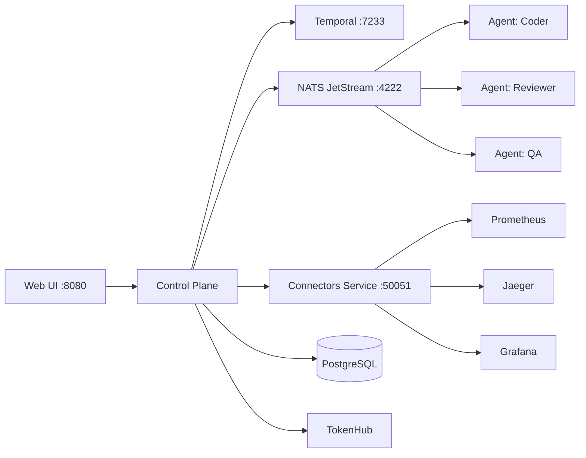

## Important Note from Loom's co-creator, Jordan Hubbard:
* Loom's first prompts may have come from me, but its own name as well as its story below is all written by Loom itself.  Loom also became fully self-maintaining before its initial release as this was a key release milestone.  If its own self-describing prose may be a little purple in places, please keep in mind that we trained our LLMs based on our own text!

# Loom

> *"From a single thread of an idea, we weave complete software."*

**Autonomous AI Agent Orchestration Platform**

## The Story of Loom

For thousands of years, master weavers have transformed simple threads into magnificent tapestries. They didn't work alone—apprentices prepared threads, dyers created colors, designers planned patterns. Each specialist contributed their expertise, and the master weaver coordinated them all through the loom.

Software development follows the same ancient pattern. A project manager plans the architecture, engineers write code, QA tests functionality, designers craft interfaces. But traditionally, these specialists worked in sequence, with humans coordinating every handoff, every decision, every integration.

**Loom changes this.**

Just as a master weaver operates a loom to coordinate multiple threads into unified fabric, Loom orchestrates multiple AI agents—each with specialized expertise—to weave complete software from a simple Product Requirements Document (PRD). You provide the thread of an idea. Loom weaves it into reality.

Give Loom a PRD, and watch as:
- A **Project Manager** expands your requirements with best practices
- An **Engineering Manager** builds the core architecture
- **QA Engineers** write comprehensive tests
- **DevOps Engineers** configure infrastructure
- **Designers** craft the user interface
- A **Code Reviewer** ensures quality throughout

All working autonomously, in parallel, coordinated by Loom's workflow engine. From PRD to working MVP in hours, not weeks.

This is the craft of software, elevated by the ancient wisdom of the loom.

---

## Quick Start

New to Loom? See **[QUICKSTART.md](QUICKSTART.md)** to get running in 10 minutes: start the server, connect to TokenHub, add your first project, and file beads from the CEO dashboard.

### UI Ports

Once Loom is running, access the various interfaces:

- **Loom Main UI**: http://localhost:8080 — Main dashboard, beads, agents, projects
- **Grafana Dashboards**: http://localhost:3000 — Metrics visualization and monitoring (admin/admin)
- **Prometheus**: http://localhost:9090 — Metrics queries and alerts
- **Jaeger Tracing**: http://localhost:16686 — Distributed tracing and performance analysis
- **Temporal UI**: http://localhost:8088 — Workflow monitoring and debugging

---

## What is Loom?

Loom is a lightweight AI coding agent orchestration system that manages workflows, handles agent lifecycle, and provides real-time event streaming for monitoring and coordination.

**Core Capabilities:**

- **🚀 Project Bootstrap**: Create complete projects from a PRD
  - Autonomous PRD expansion with best practices
  - Automatic epic and story breakdown
  - Agent work assignment and orchestration
  - CEO review and approval workflows

- **🤖 Multi-Agent Orchestration**: Specialized AI agents working in harmony
  - Project Managers, Engineers, QA, DevOps, Designers
  - Parallel task execution with dependency management
  - Autonomous decision-making within defined guardrails

- **🔄 Workflow Engine**: Temporal-based reliable execution
  - Durable workflows that survive failures
  - Complex multi-step processes
  - Human-in-the-loop approval gates

- **📊 Git-Backed Issue Tracking**: Beads system for persistent work tracking
  - Issues survive context compaction
  - Dependency tracking (blockers, blocked-by)
  - Cross-session context recovery

- **🎯 Intelligent Routing**: Smart work assignment
  - Role-based bead matching
  - Workflow-based task progression
  - Priority and tag-based filtering
  - LLM routing delegated to [TokenHub](https://github.com/jordanhubbard/tokenhub)

## Documentation

Full documentation is available at **[jordanhubbard.github.io/loom](https://jordanhubbard.github.io/loom/)** or via the built-in docs browser at `/api/v1/docs`.

**Start here**: [Quick Start](QUICKSTART.md) -- Get running in 10 minutes

| Guide | Audience | Content |
|---|---|---|
| [User Guide](docs/guide/user/index.md) | End users | Dashboard, projects, beads, agents, workflows, decisions |
| [Admin Guide](docs/guide/admin/index.md) | Operators | Configuration, TokenHub integration, deployment, security, observability |
| [Developer Guide](docs/guide/developer/index.md) | Contributors | Architecture, API, microservices, agent actions, plugins |
| [Reference](docs/guide/reference/api-endpoints.md) | All | API endpoints, entities, config options |

Build documentation locally:

```bash
make docs-serve   # http://localhost:8000
```

## Features

- 🤖 **Agent Orchestration**: Spawn and manage AI agents with different personas
- 🔄 **Workflow Management**: Temporal-based workflow orchestration for reliable task execution
- 📊 **Work Graph**: Track dependencies and relationships between work items (beads)
- 🔐 **Decision Framework**: Approval workflows for agent decisions
- 🔏 **API Auth & RBAC**: JWT bearer tokens, API keys, and role-based permissions
- 📡 **Real-time Events**: Server-Sent Events (SSE) for live status updates
- 🔔 **Activity Feed & Notifications**: Team activity tracking with intelligent user notifications
- 🎯 **Smart Routing**: Intelligent task assignment and agent coordination; LLM routing via TokenHub
- 🔒 **Secure**: Encrypted secret storage and secure credential management
- 📈 **Analytics & Cost Tracking**: Real-time usage monitoring, cost tracking, and spending alerts
- 🔍 **Usage Pattern Analysis**: Multi-dimensional pattern clustering, anomaly detection, and cost optimization recommendations
- 🔁 **Multi-Turn Action Loop**: Agents iterate with LLM feedback — read, write, search, and close beads autonomously
- 💬 **Pair-Programming Mode**: Interactive real-time chat with agents scoped to specific beads
- ⚡ **TokenHub Integration**: Single LLM provider — all model routing, failover, and provider management delegated to [TokenHub](https://github.com/jordanhubbard/tokenhub)
- 📊 **OpenTelemetry Observability**: Full-stack observability with distributed tracing, metrics, and visualization
  - Jaeger for distributed tracing with span-level detail
  - Prometheus for metrics collection and alerting
  - Grafana for dashboards and visualization
  - Custom metrics for agents, dispatch, and workflows

## Default Personas

Default personas are available under `./personas/`:

- `personas/loom` — Loom-specific system persona(s)
- `personas/default/ceo` — Human CEO decision maker (tie-breaks / approvals)
- `personas/default/project-manager` — Plans work, files beads, drives delivery
- `personas/default/product-manager` — Identifies feature gaps and writes PRDs for epics
- `personas/default/engineering-manager` — Reviews technical direction and feasibility
- `personas/default/code-reviewer` — Reviews patches for correctness and quality
- `personas/default/qa-engineer` — Testing strategy and verification
- `personas/default/devops-engineer` — Deployment/ops and infrastructure guidance
- `personas/default/documentation-manager` — Keeps docs accurate per doc policy
- `personas/default/decision-maker` — Resolves routine decisions (non-CEO)
- `personas/default/web-designer` — UX/UI guidance
- `personas/default/web-designer-engineer` — UX/UI + implementation guidance
- `personas/default/public-relations-manager` — Messaging/launch communication support
- `personas/default/housekeeping-bot` — Cleanup and hygiene tasks

## Architecture

Loom is a Go monorepo with a microservices runtime:



- **Control Plane** -- HTTP API, dispatcher, workflow engine
- **Agents** -- Autonomous workers subscribing to NATS topics
- **TokenHub** -- LLM proxy handling model routing, failover, and provider management
- **Connectors Service** -- External integrations via gRPC
- **Temporal** -- Durable workflow orchestration
- **NATS JetStream** -- Inter-service messaging
- **Observability** -- OpenTelemetry, Prometheus, Jaeger, Grafana, Loki

For the full architecture, see the [Developer Guide](docs/guide/developer/architecture.md).

## Project Structure

```
loom/
├── cmd/
│   ├── loom/                  # Control plane binary
│   ├── loom-project-agent/    # Agent binary
│   ├── connectors-service/    # Connectors gRPC service
│   └── loomctl/              # CLI tool
├── internal/                  # Private application packages
├── pkg/                       # Shared packages
├── web/static/                # Web UI assets
├── docs/                      # Documentation (mkdocs source)
├── deploy/k8s/                # Kubernetes manifests
├── config/                    # Service configurations
├── personas/                  # Agent persona definitions
├── docker-compose.yml         # Full development stack
└── Makefile                   # Build, test, deploy commands
```

## Contributing

See the [Contributing Guide](docs/guide/developer/contributing.md) for development setup, code style, and PR workflow.

```bash
make build       # Build all binaries
make test        # Run test suite
make lint        # Run all linters
make start       # Start Docker stack
make docs-serve  # Serve documentation locally
```

## License

See LICENSE file for details.
