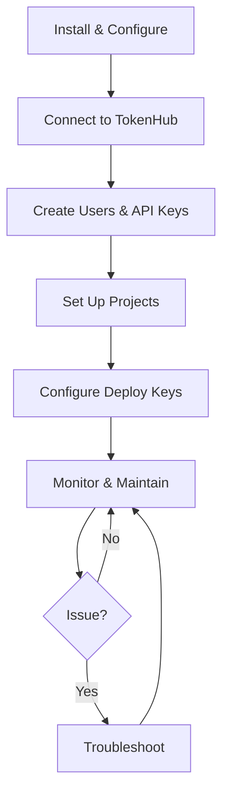

# Loom Administrator Guide

This guide is for **administrators** who configure, operate, and maintain a Loom deployment. For getting Loom running, see the [Installation Guide](../../getting-started/setup.md). For end-user workflows, see the [User Guide](../user/index.md).

---

## Overview



---

## Initial Configuration

### config.yaml

Loom reads its configuration from `config.yaml` (override with `-config /path/to/config.yaml`). Key sections:

#### Server

```yaml
server:
  http_port: 8081
  https_port: 8443
  enable_http: true
  enable_https: false
  tls_cert_file: ""
  tls_key_file: ""
  read_timeout: 30s
  write_timeout: 30s
  idle_timeout: 120s
```

#### Database

```yaml
database:
  type: sqlite          # sqlite or postgres
  path: ./loom.db       # SQLite file path
  # dsn: ""             # PostgreSQL connection string
```

#### Security

```yaml
security:
  enable_auth: false          # Set true for production
  jwt_secret: "change-me"    # Stable secret for JWT signing
  allowed_origins: ["*"]     # Restrict in production
  webhook_secret: ""         # For GitHub webhook verification
```

#### Temporal

```yaml
temporal:
  host: localhost:7233
  namespace: default
  task_queue: loom-tasks
  workflow_execution_timeout: 24h
  enable_event_bus: true
```

#### Agents

```yaml
agents:
  max_concurrent: 6
  default_persona_path: ./personas
  heartbeat_interval: 30s
  file_lock_timeout: 10m
  allowed_roles:
    - ceo
    - project-manager
    - engineering-manager
    - code-reviewer
    - qa
    - devops-engineer
```

#### Dispatch

```yaml
dispatch:
  max_hops: 20    # Max redispatches before P0 escalation
```

#### Cache

```yaml
cache:
  enabled: true
  backend: memory       # or "redis"
  default_ttl: 1h
  max_size: 10000
  max_memory_mb: 500
  redis_url: ""         # If using Redis
```

#### Git

```yaml
git:
  project_key_dir: ./data/projects   # SSH key storage directory
```

### Environment Variables

| Variable | Description | Default |
|---|---|---|
| `LOOM_PASSWORD` | Master password for key encryption and UI login | `loom-default-password` |
| `TEMPORAL_HOST` | Temporal server address | `localhost:7233` |
| `TEMPORAL_NAMESPACE` | Temporal namespace | `default` |

Set `LOOM_PASSWORD` in a `.env` file at the project root or export it in your shell. **Always change the default password in production.**

### Changing the Default Password

The default admin credentials are `admin` / `admin`. Change them immediately:

```bash
# Login
TOKEN=$(curl -s -X POST http://localhost:8080/api/v1/auth/login \
  -H "Content-Type: application/json" \
  -d '{"username":"admin","password":"admin"}' | jq -r .token)

# Change password
curl -X POST http://localhost:8080/api/v1/auth/change-password \
  -H "Authorization: Bearer $TOKEN" \
  -H "Content-Type: application/json" \
  -d '{"current_password":"admin","new_password":"YOUR_STRONG_PASSWORD"}'
```

---

## TokenHub Integration

I delegate all LLM provider management to [TokenHub](https://github.com/jordanhubbard/tokenhub). Physical providers (Anthropic, OpenAI, vLLM, etc.) are configured in TokenHub during its onboarding. I just need to know where TokenHub is and how to authenticate.

### Registering TokenHub

TokenHub is registered via the REST API -- **not** in `config.yaml`. This keeps API keys and local endpoints out of version control.

```bash
curl -X POST http://localhost:8081/api/v1/providers \
  -H "Content-Type: application/json" \
  -d '{
    "id": "tokenhub",
    "name": "TokenHub",
    "type": "openai",
    "endpoint": "http://localhost:8090/v1",
    "model": "anthropic/claude-sonnet-4-20250514",
    "api_key": "your-tokenhub-api-key"
  }'
```

API keys are stored in my encrypted vault (not in plaintext on disk) and persist across restarts.

### Using bootstrap.local for Repeatable Setup

For reproducible setup, use a `bootstrap.local` script (gitignored). The authoritative sample lives in the [TokenHub repo](https://github.com/jordanhubbard/tokenhub/blob/main/bootstrap.local.example):

```bash
cp bootstrap.local.example bootstrap.local
chmod +x bootstrap.local
vim bootstrap.local    # Set your TokenHub endpoint and API key
./bootstrap.local      # Register TokenHub with Loom
```

The script uses `tokenhubctl` for TokenHub admin operations and `curl` for registering TokenHub as my provider. Environment variables are expanded by the shell, so API keys never appear in the file itself.

**When to run `bootstrap.local`:**
- After a fresh install or database wipe (`make distclean`)
- After restoring from backup (providers are in the DB, but run it if the DB was lost)

**You do NOT need to re-run it** after normal restarts -- providers persist in the database.

### Why Not config.yaml?

`config.yaml` is committed to git. Provider configuration contains:
- API keys (secrets)
- Local network endpoints (e.g., `http://tokenhub:8090`) that only apply to one deployment
- Model selections that vary per environment

None of this belongs in version control. The `bootstrap.local` pattern keeps deployment-specific configuration local while `config.yaml` holds structural settings shared across all deployments.

### Provider Fields

| Field | Description |
|---|---|
| `id` | Unique identifier (typically `tokenhub`) |
| `name` | Display name |
| `type` | Always `openai` (TokenHub speaks OpenAI-compatible API) |
| `endpoint` | TokenHub API URL |
| `api_key` | TokenHub API credential (stored encrypted) |
| `model` | Default model name |
| `status` | `pending`, `active`, `healthy`, `error`, `failed` |

### Provider API Endpoints

```
GET    /api/v1/providers              # List providers
POST   /api/v1/providers              # Register a provider
GET    /api/v1/providers/{id}         # Get provider details
PUT    /api/v1/providers/{id}         # Update provider
DELETE /api/v1/providers/{id}         # Delete provider
```

### Health Monitoring

I automatically check TokenHub health via periodic heartbeats. Provider status is one of:

- **healthy** -- Responding normally
- **active** -- Registered and enabled
- **error** -- Temporary failure (will retry)
- **failed** -- Persistent failure

### Managing Physical Providers

Physical providers are managed through TokenHub, not through me. Use `tokenhubctl`:

```bash
tokenhubctl provider list                    # List configured providers
tokenhubctl provider add --name anthropic \
    --type anthropic --api-key "$KEY"        # Add a provider
tokenhubctl model list                       # List available models
tokenhubctl routing get                      # Check routing policy
```

---

## Project Management

### Creating a Project

Projects can be created via API or defined in `config.yaml`:

**Via API:**
```bash
curl -X POST http://localhost:8080/api/v1/projects \
  -H "Content-Type: application/json" \
  -d '{
    "id": "my-project",
    "name": "My Project",
    "git_repo": "git@github.com:org/repo.git",
    "branch": "main",
    "beads_path": ".beads",
    "git_auth_method": "ssh",
    "is_perpetual": false,
    "is_sticky": true,
    "context": {
      "build_command": "make build",
      "test_command": "make test"
    }
  }'
```

**Via config.yaml:**
```yaml
projects:
  - id: my-project
    name: My Project
    git_repo: git@github.com:org/repo.git
    branch: main
    beads_path: .beads
    git_auth_method: ssh
    is_perpetual: false
    is_sticky: true
```

### Bootstrapping a Project from a PRD

Bootstrap creates a complete project from a Product Requirements Document:

```bash
curl -X POST http://localhost:8080/api/v1/projects/bootstrap \
  -H "Content-Type: application/json" \
  -d '{
    "name": "My New App",
    "git_repo": "git@github.com:org/my-new-app.git",
    "branch": "main",
    "prd_content": "Build a REST API for user management with JWT auth..."
  }'
```

The response includes a generated SSH public key and setup instructions:

```json
{
  "project": { "id": "my-new-app", "name": "My New App", ... },
  "public_key": "ssh-ed25519 AAAAC3NzaC1lZDI1NTE5AAAA... loom-deploy-key",
  "git_setup_instructions": "Add this public key as a deploy key..."
}
```

### SSH Deploy Key Setup

When a project is bootstrapped or its SSH key is first needed, Loom generates an ed25519 keypair. The private key is stored encrypted in the database (survives container rebuilds). The public key must be registered with your Git provider.

#### Step 1: Get the Public Key

```bash
curl http://localhost:8080/api/v1/projects/my-project/git-key
```

Response:
```json
{
  "project_id": "my-project",
  "auth_method": "ssh",
  "public_key": "ssh-ed25519 AAAAC3NzaC1lZDI1NTE5AAAA... loom-deploy-key",
  "rotated": false
}
```

#### Step 2: Register as a Deploy Key

**GitHub:**
1. Go to your repository on GitHub
2. Navigate to **Settings** > **Deploy keys**
3. Click **Add deploy key**
4. Paste the public key from Step 1
5. **Check "Allow write access"** (required for Loom to push commits)
6. Click **Add key**

**GitLab:**
1. Go to your project on GitLab
2. Navigate to **Settings** > **Repository** > **Deploy keys**
3. Add the public key with write access

**Bitbucket:**
1. Go to your repository on Bitbucket
2. Navigate to **Settings** > **Access keys**
3. Add the public key

#### Step 3: Verify

After adding the deploy key, Loom's readiness check will confirm git access:

```bash
curl http://localhost:8080/api/v1/projects/my-project/state
```

Check `readiness_ok: true` in the response. Dispatch will not assign work until git access is verified.

#### Rotating Keys

To generate a new keypair (invalidates the old one):

```bash
curl -X POST http://localhost:8080/api/v1/projects/my-project/git-key
```

Remember to update the deploy key in your Git provider after rotation.

### Project Lifecycle

```
POST /api/v1/projects/{id}/close    # Close (requires no open work, or triggers decision)
POST /api/v1/projects/{id}/reopen   # Reopen a closed project
GET  /api/v1/projects/{id}/state    # Get state with readiness info
GET  /api/v1/projects/{id}/comments # Get project comments
POST /api/v1/projects/{id}/comments # Add a comment
POST /api/v1/projects/{id}/agents   # Assign/unassign agents
```

---

## User Management

### Creating Users

```bash
curl -X POST http://localhost:8080/api/v1/auth/users \
  -H "Authorization: Bearer $TOKEN" \
  -H "Content-Type: application/json" \
  -d '{
    "username": "alice",
    "email": "alice@example.com",
    "role": "user",
    "password": "secure-password"
  }'
```

### Roles and Permissions

| Role | Permissions | Description |
|---|---|---|
| `admin` | `*:*` | Full system access |
| `user` | Read + write on most resources | Standard user |
| `viewer` | Read-only | Monitoring only |
| `service` | Custom per API key | Service-to-service |

Permissions use `resource:action` format:

| Resource | Actions |
|---|---|
| `agents` | `read`, `write`, `delete`, `admin` |
| `beads` | `read`, `write`, `delete`, `admin` |
| `providers` | `read`, `write`, `delete`, `admin` |
| `projects` | `read`, `write`, `delete`, `admin` |
| `decisions` | `read`, `write`, `delete`, `admin` |
| `system` | `admin` |
| `repl` | `use` |

### API Keys

Create API keys for service-to-service authentication:

```bash
curl -X POST http://localhost:8080/api/v1/auth/api-keys \
  -H "Authorization: Bearer $TOKEN" \
  -H "Content-Type: application/json" \
  -d '{
    "name": "ci-bot",
    "permissions": ["beads:read", "projects:read"],
    "expires_in": 86400
  }'
```

The full key is returned **once** — store it securely. Use it via the `X-API-Key` header:

```bash
curl -H "X-API-Key: loom_..." http://localhost:8080/api/v1/projects
```

---

## Monitoring

### Health Endpoints

| Endpoint | Purpose |
|---|---|
| `GET /health/live` | Liveness probe (process alive) |
| `GET /health/ready` | Readiness probe (DB connected, dependencies healthy) |
| `GET /health` | Detailed health with runtime metrics |
| `GET /metrics` | Prometheus-compatible metrics |

### Real-Time Event Streaming

```bash
# Stream all events (SSE)
curl -N http://localhost:8080/api/v1/events/stream

# Filter by project
curl -N http://localhost:8080/api/v1/events/stream?project_id=my-project

# Filter by event type
curl -N http://localhost:8080/api/v1/events/stream?type=agent.spawned
```

Event types include: `agent.spawned`, `agent.status_change`, `agent.completed`, `bead.created`, `bead.assigned`, `bead.status_change`, `bead.completed`, `decision.created`, `decision.resolved`, `log.message`.

### Activity Feed

```bash
# Recent activity
curl http://localhost:8080/api/v1/activity-feed

# Filter by project
curl http://localhost:8080/api/v1/activity-feed?project_id=my-project

# Aggregated view (collapses similar events within 5min)
curl http://localhost:8080/api/v1/activity-feed?aggregated=true

# Stream in real-time
curl -N http://localhost:8080/api/v1/activity-feed/stream
```

### Analytics and Cost Tracking

```bash
# Usage statistics
curl http://localhost:8080/api/v1/analytics/stats

# Cost reports
curl http://localhost:8080/api/v1/analytics/costs

# Export data
curl http://localhost:8080/api/v1/analytics/export

# System logs
curl http://localhost:8080/api/v1/logs/recent
curl -N http://localhost:8080/api/v1/logs/stream    # Real-time log stream
```

### Temporal UI

The Temporal UI runs on port **8088** and provides visibility into workflow execution:

- View running and completed workflows
- Inspect workflow history and event logs
- Monitor task queue depth
- Debug failed workflows

Access at: `http://localhost:8088`

---

## Backup and Recovery

### What to Back Up

| Data | Location | Method |
|---|---|---|
| SQLite database | `./loom.db` | `sqlite3 loom.db ".backup backup.db"` |
| Key store | `./.keys.json` | File copy |
| SSH keys (filesystem) | `./data/projects/` | File copy (also in DB) |
| Configuration | `config.yaml`, `.env` | File copy |
| Personas | `./personas/` | Version control |
| Beads | `.beads/` per project | Managed by git |

SSH private keys are encrypted and stored in the `credentials` table. As long as the database and key store are backed up, keys can be restored to any new deployment.

### Backup Script

```bash
#!/bin/bash
BACKUP_DIR="./backups/$(date +%Y%m%d-%H%M%S)"
mkdir -p "$BACKUP_DIR"

# Database (online-safe)
sqlite3 loom.db ".backup $BACKUP_DIR/loom.db"

# Key store
cp .keys.json "$BACKUP_DIR/" 2>/dev/null

# Configuration
cp config.yaml "$BACKUP_DIR/"

# Personas
cp -r personas "$BACKUP_DIR/"

echo "Backup completed: $BACKUP_DIR"
```

### Restore Procedure

1. Stop Loom: `docker compose down`
2. Replace `loom.db` with the backup
3. Replace `.keys.json` with the backup (must match the database — keys were encrypted with this key store)
4. Restore `config.yaml`
5. Start Loom: `docker compose up -d`

SSH keys will be automatically restored from the database on first use.

---

## Troubleshooting

### Temporal Not Connecting

**Symptoms:** Workflows don't start, heartbeat missing.

1. Check Temporal is running: `docker compose ps temporal`
2. Verify the host: `curl http://localhost:7233` should respond
3. Check env overrides: `TEMPORAL_HOST`, `TEMPORAL_NAMESPACE`
4. The fallback dispatch loop (every 10s) handles work even if Temporal is down

### TokenHub Health Failures

**Symptoms:** Provider shows `error` or `failed` status.

1. Check TokenHub is running: `tokenhubctl status`
2. Verify API key is correct and not expired
3. Check `last_heartbeat_error` in provider details
4. Verify TokenHub endpoint is reachable: `curl <endpoint>/models`

### Git Access Denied

**Symptoms:** `readiness_ok: false`, git operations fail.

1. Verify deploy key is registered: check your Git provider's deploy key settings
2. Ensure **write access** is enabled for the deploy key
3. Check the public key matches: `GET /api/v1/projects/{id}/git-key`
4. Rotate if needed: `POST /api/v1/projects/{id}/git-key` (then re-register)
5. Check key storage: if filesystem key is missing, Loom restores from database automatically

### Database Issues

**Symptoms:** Startup failures, missing data.

1. Check DB file exists and is readable: `ls -la loom.db`
2. Verify integrity: `sqlite3 loom.db "PRAGMA integrity_check;"`
3. For PostgreSQL: check DSN and connectivity
4. Migrations run automatically on startup — check logs for migration errors

### Beads Not Loading

**Symptoms:** No work items appear for a project.

1. Verify `beads_path` in project config points to a valid `.beads/` directory
2. Check `bd list` works in the project's git working directory
3. Ensure the git repository was cloned successfully
4. Check project readiness: `GET /api/v1/projects/{id}/state`

### Dispatch Not Working

**Symptoms:** Beads stay in `open` status, no agents pick up work.

1. Check agents are assigned to the project: `GET /api/v1/projects/{id}`
2. Check for blocked beads: dependencies may not be resolved
3. Verify TokenHub is healthy and agents can reach it
4. Check `dispatch.max_hops` — beads dispatched more than this many times are escalated to P0
5. Review Temporal UI at `:8088` for workflow errors
