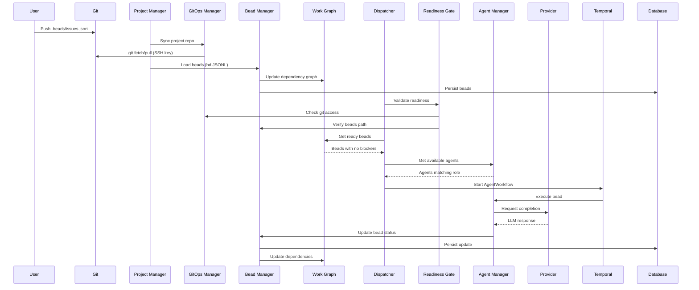
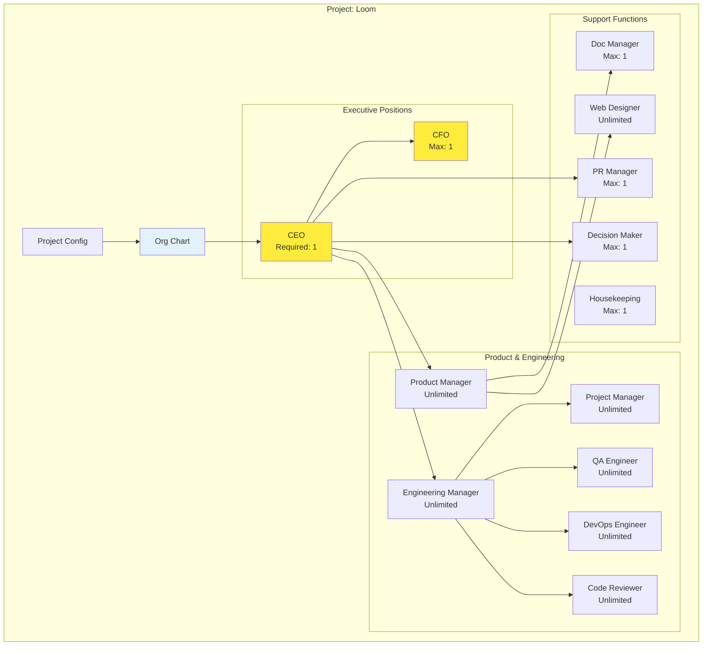
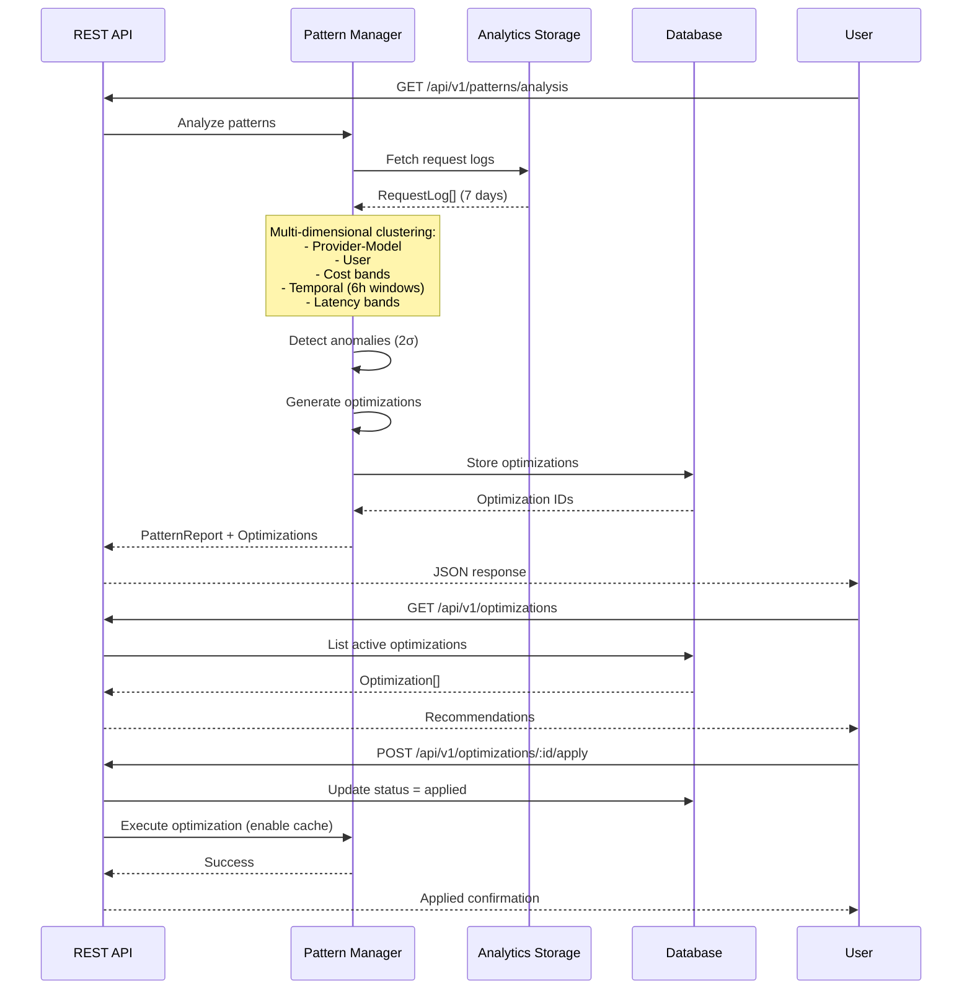
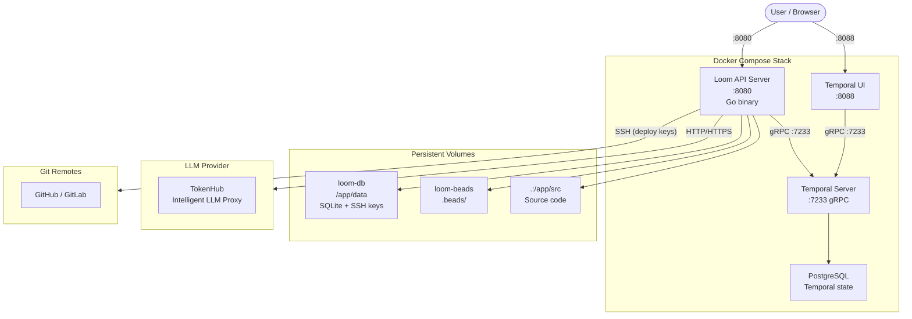
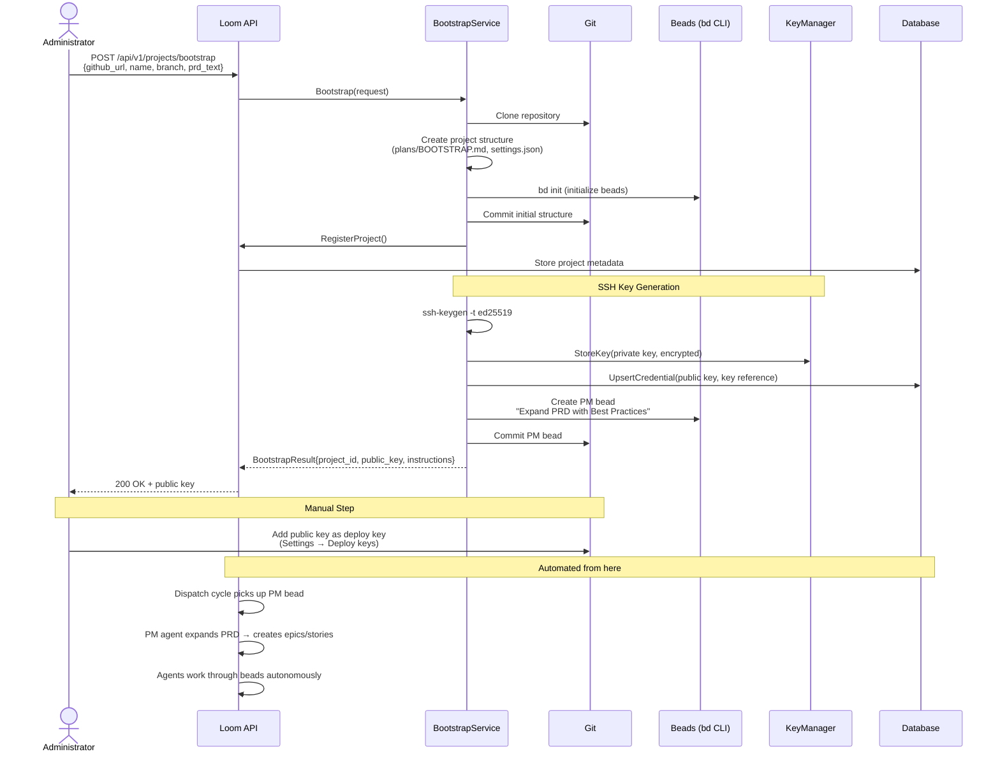
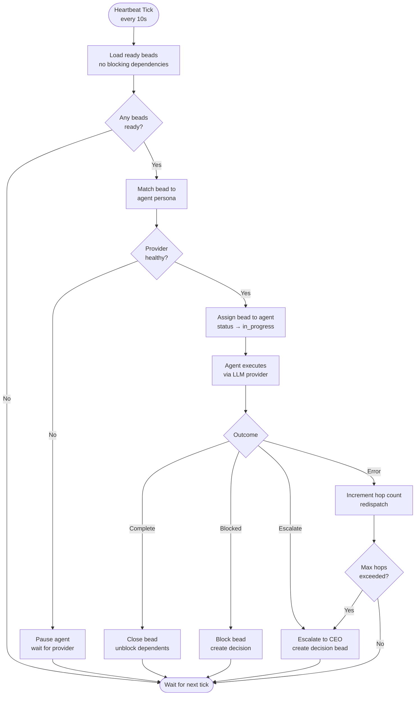
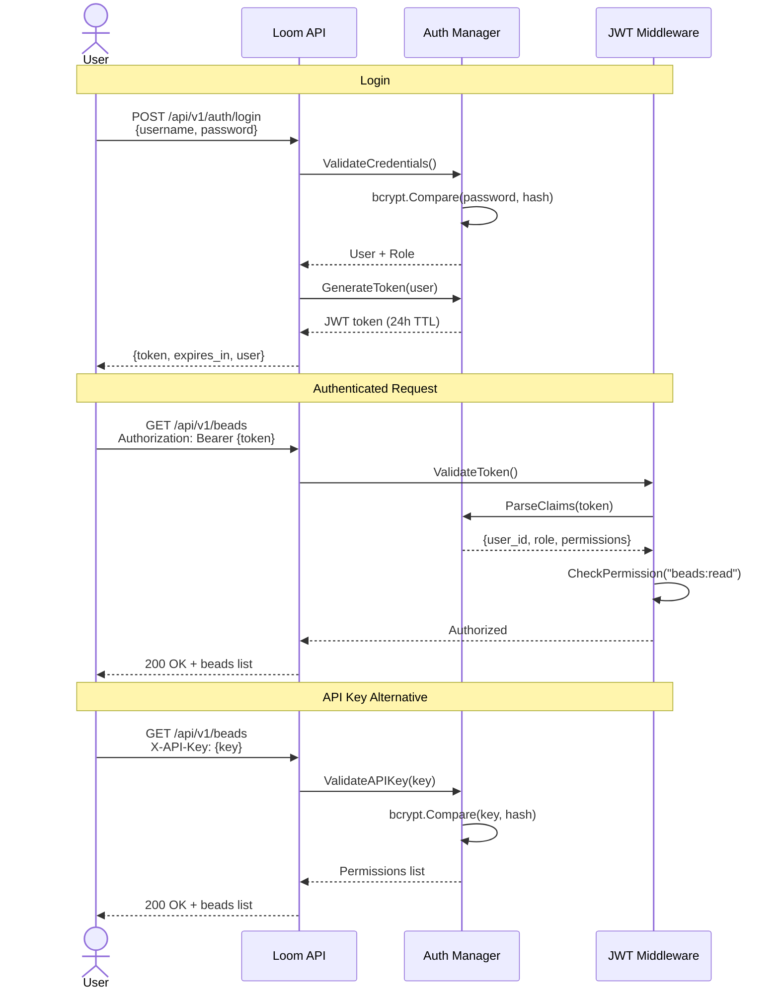
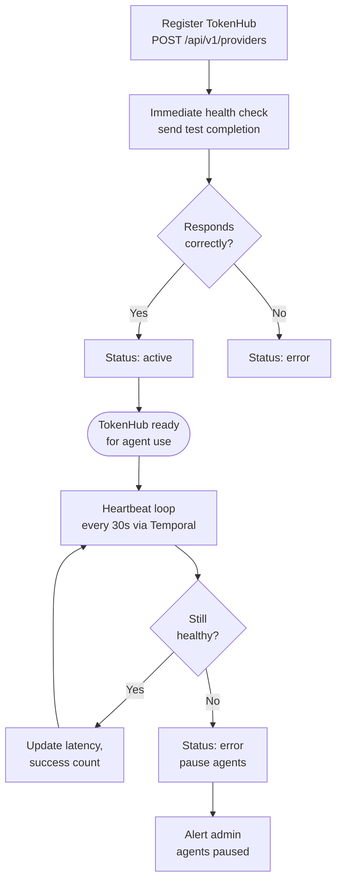
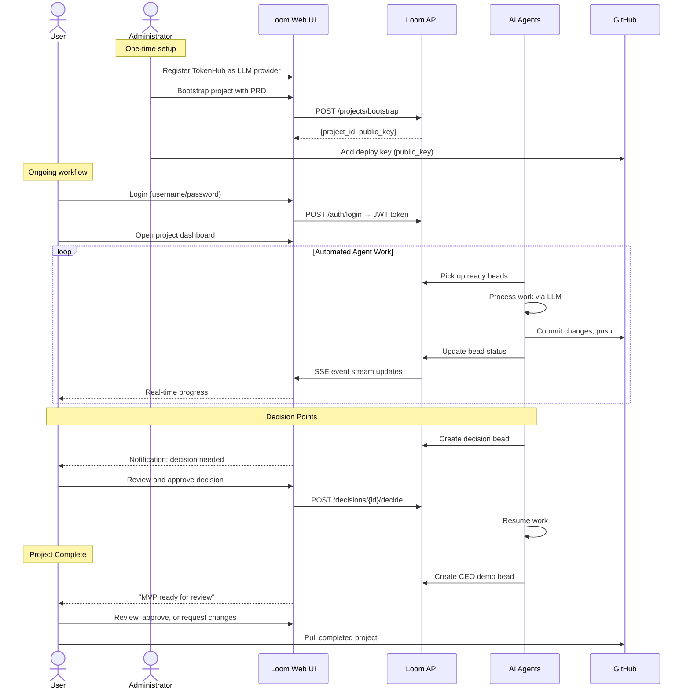

# Loom Architecture Guide

**Last Updated**: February 21, 2026 (TokenHub-only architecture, removed provider routing/scoring/complexity)

This document describes the architecture of Loom, the Agent Orchestration System for managing distributed AI workflows.

## System Overview

Loom is a comprehensive agent orchestration platform that:
- Coordinates multiple AI agents with different roles (personas)
- Manages work items (beads) through a distributed workflow engine
- Integrates with external LLM providers for agent execution
- Uses Temporal for reliable workflow orchestration
- Persists all state to a SQLite database
- Provides a real-time web UI for monitoring and control
- **v1.0**: Multi-user authentication with role-based access control
- **v1.0**: TokenHub integration as sole LLM provider
- **v1.0**: Server-sent events for real-time streaming responses
- **NEW (v1.1)**: Analytics dashboard with real-time usage monitoring
- **NEW (v1.1)**: Per-user and per-provider cost tracking
- **NEW (v1.1)**: Privacy-first logging with GDPR compliance
- **NEW (v1.1)**: Spending alerts and anomaly detection
- **NEW (v1.2)**: Motivation system for proactive agent workflows
- **NEW (v1.2)**: Idle detection with system/project/agent granularity
- **NEW (v1.2)**: GitHub webhook integration for external events
- **NEW (v1.2)**: Milestone and deadline tracking
- **NEW (v1.3)**: Activity feed and team notifications system
- **NEW (v1.4)**: Usage pattern analysis and cost optimization engine
- **NEW (v1.4)**: Critical work flow fixes (provider activation, agent recovery)
- **NEW (v1.5)**: Multi-turn action loop engine with iterative LLM feedback
- **NEW (v1.5)**: Pair-programming mode for interactive human-agent chat
- **NEW (v1.5)**: Auto-provider assignment (zero-config agent setup)
- **NEW (v1.5)**: Dolt database support with federation and SQL server
- **NEW (v2.0)**: TokenHub-only architecture -- removed ~6,000 lines of provider routing, scoring, complexity estimation, and GPU selection

## Core Components

### 1. Agent System

**Purpose**: Manage autonomous AI agents with role-based personas

**Key Files**: 
- `internal/loom/worker_manager.go`
- `internal/models/agent.go`

**Concepts**:
- **Agent**: An autonomous actor with a defined role and persona
- **Persona**: Instructions, guidelines, and behavioral rules for an agent
- **Status**: `idle`, `working`, `paused`, `complete`
- **Role**: Org chart position (CEO, CFO, Engineer, etc.)

**Workflow**:
1. Agents are created from personas on project assignment
2. Agents remain paused until a provider becomes available
3. When providers are healthy, agents resume and can accept work
4. Agents process beads, make decisions, request escalations

**Database**: `agents` table with status, role, and capability tracking

### 2. Bead System (Work Items)

**Purpose**: Define and track discrete units of work in the system

**Key Files**:
- `internal/models/bead.go`
- `docs/BEADS_WORKFLOW.md`

**Concepts**:
- **Bead**: A JSONL-defined work item managed by the `bd` CLI
- **Status**: `open`, `in_progress`, `done`, `blocked`
- **Type**: Describes the work (feature, bugfix, test, decision, etc.)
- **Dependencies**: `blocked_by`, `blocks`, `parent`, `children`

**Workflow**:
1. Beads are stored in `.beads/issues.jsonl` (managed by `bd`)
2. Each bead has a unique ID and metadata
3. Beads are loaded at startup and on project changes
4. Agents process ready beads (no blocking dependencies)
5. Completion updates the work graph in real-time

**Database**: `beads` table with status, priority, and dependency tracking

### 3. Provider System

**Purpose**: Connect to TokenHub for all LLM operations

**Key Files**:
- `internal/provider/registry.go`
- `internal/models/provider.go`

**Concepts**:
- **Provider**: A registered LLM service endpoint (in practice, TokenHub)
- **Endpoint**: Network address for TokenHub's OpenAI-compatible API
- **Model**: LLM model requested via TokenHub (e.g., `anthropic/claude-sonnet-4-20250514`)
- **Status**: `pending`, `active`, `healthy`, `error`, `failed`

**Architecture**:
I delegate all LLM provider management to TokenHub. Physical providers (Anthropic, OpenAI, vLLM, etc.) are configured in TokenHub during its onboarding. I just register TokenHub as my sole provider and forward all requests through it.

**Workflow**:
1. TokenHub is registered via API or `bootstrap.local` with endpoint and API key
2. Immediate health check validates connectivity
3. Provider heartbeat workflow monitors health (30s interval)
4. On status change, agents resume or pause accordingly
5. Dispatcher assigns the sole active provider to all work

**What Was Removed (v2.0)**:
- `internal/routing/` -- Four routing policies (minimize_cost, minimize_latency, maximize_quality, balanced)
- Provider scoring, complexity estimation, GPU selection (~6,000 lines)
- Ollama protocol support
- `/api/v1/routing/select` and `/api/v1/routing/policies` endpoints
- `/api/v1/providers/{id}/negotiate` endpoint
- `loomctl provider` commands
- Provider management UI (health ring, analytics charts, SSE handlers)

**Database**: `providers` table with endpoint, status, and heartbeat tracking

### 3.2 Authentication & Authorization System (NEW v1.0)

**Purpose**: Secure multi-user deployments with role-based access control

**Key Files**:
- `internal/auth/manager.go`
- `internal/auth/middleware.go`
- `internal/auth/handlers.go`
- `internal/auth/models.go`

**Authentication Methods**:
1. **JWT Bearer Tokens**: For user sessions (24h expiration)
2. **API Keys**: For service-to-service integrations

**User Roles**:
- `admin`: Full system access (*:* permissions)
- `user`: Read/write access to most resources
- `viewer`: Read-only access
- `service`: Custom permissions per API key

**Permissions**:
Format: `<resource>:<action>` (e.g., `agents:read`, `beads:write`)
- Resources: agents, beads, providers, projects, decisions, repl, system
- Actions: read, write, delete, admin
- Wildcards: `*:*`, `agents:*`

**Per-User Provider Isolation**:
- Providers have `owner_id` and `is_shared` fields
- Users see only their providers + shared providers
- Query: `WHERE owner_id = ? OR is_shared = 1 OR owner_id IS NULL`

**User Management UI**:
- Admin-only "Users" tab for user CRUD
- Role assignment with visual badges
- API key generation with one-time display
- Secure key revocation

**API Endpoints**:
- `POST /api/v1/auth/login` - Get JWT token
- `POST /api/v1/auth/api-keys` - Create API key
- `GET /api/v1/auth/api-keys` - List user's keys
- `DELETE /api/v1/auth/api-keys/{id}` - Revoke key
- `POST /api/v1/auth/users` - Create user (admin only)
- `GET /api/v1/auth/users` - List users (admin only)

**Database**: `users` and `api_keys` managed in-memory by auth.Manager

### 4. Project System

**Purpose**: Organize work into distinct projects with independent workflows

**Key Files**:
- `internal/models/project.go`
- `internal/loom/project_manager.go`

**Concepts**:
- **Project**: A container for beads, agents, and work
- **Git Integration**: Projects map to git repos with branches
- **Beads Path**: Directory where work items are stored
- **Sticky**: Auto-registered on startup
- **Perpetual**: Never completes (continuous operations)

**Workflow**:
1. Projects are defined in `config.yaml`
2. Beads are loaded from git at startup
3. Agents are assigned to projects
4. Work is tracked and dispatched per project
5. Project state persists across restarts

**Database**: `projects` table with git, status, and configuration

### 5. Org Chart System

**Purpose**: Define and manage team structure for projects

**Key Files**:
- `pkg/models/orgchart.go`
- `internal/orgchart/manager.go`

**Concepts**:
- **OrgChart**: Project-specific team structure defining roles and reporting
- **Position**: A role slot in the org chart (CEO, PM, Engineer, etc.)
- **Template**: Default org chart cloned for new projects
- **Hierarchy**: Positions have reporting relationships (ReportsTo field)
- **Capacity**: Positions can limit instances (MaxInstances)

**Workflow**:
1. Default template created on system startup with all standard roles
2. New projects get org chart cloned from template
3. Agents are assigned to fill positions in the org chart
4. UI displays agents sorted by org chart hierarchy
5. Required positions must be filled for project to be active

**API**: `GET /api/v1/org-charts/{projectId}` for retrieving project org structure

**Database**: `org_charts` and `org_chart_positions` tables (schema exists, in-memory storage currently used)

### 6. Model Catalog System

**Purpose**: Manage recommended models and enable intelligent provider negotiation

**Key Files**:
- `internal/modelcatalog/catalog.go`
- `internal/models/model_catalog.go`

**Concepts**:
- **ModelSpec**: Metadata about a model (params, precision, interactivity)
- **Parsing**: Automatic extraction of model attributes from names
- **Scoring**: Heuristic ranking based on size, speed, and quality
- **Negotiation**: SelectBest chooses optimal model from available options

**Features**:
- Parses model names to extract total/active params (MoE support)
- Detects precision (BF16, FP16, INT8, etc.)
- Identifies instruct-tuned models
- Scores models by interactivity (fast/medium/slow) and size
- Case-insensitive matching during negotiation

**Workflow**:
1. Provider registration includes configured model preference
2. Provider bootstrap queries available models
3. Catalog.SelectBest picks highest-scoring available model
4. Selection reason and score persisted to provider metadata
5. Provider negotiation can be manually retriggered via API

**Database**: Provider table stores `selected_model`, `selection_reason`, and `model_score`

### 7. Temporal Orchestration

**Purpose**: Provide reliable, durable workflow execution with temporal primitives

**Key Files**:
- `internal/temporal/manager.go` (orchestration)
- `internal/temporal/workflows/` (workflow definitions)
- `internal/temporal/activities/` (work implementations)
- `internal/temporal/dsl_parser.go` (DSL parsing)
- `internal/temporal/dsl_executor.go` (DSL execution)

**Concepts**:
- **Workflow**: Long-running business process with retry/resume semantics
- **Activity**: Atomic unit of work within a workflow
- **Signal**: Message sent to running workflows
- **Query**: Request for state from running workflows
- **Schedule**: Recurring workflow execution

**Key Workflows**:
- `LoomHeartbeatWorkflow`: Master clock (10s interval)
- `DispatcherWorkflow`: Work distribution (5s interval)
- `ProviderHeartbeatWorkflow`: Provider health checks (30s interval)
- `BeadProcessingWorkflow`: Agent work execution
- `DecisionWorkflow`: Escalation and approval workflows

**DSL Support**:
- Agents/providers can embed `<temporal>...</temporal>` blocks
- DSL is parsed, executed, and stripped before sending to providers
- See `docs/TEMPORAL_DSL.md` for complete syntax

### 8. Database Layer

**Purpose**: Persist all system state across restarts

**Key Files**:
- `internal/database/database.go`
- `internal/database/models.go`

**Implementation**: SQLite (default) or Dolt (git-for-data, with federation support)

**Dolt Backend** (NEW v1.5):
- Dolt SQL server on port 3307 (bootstrapped in container entrypoint)
- Schema defined in `scripts/beads-schema.sql` (16 tables, 2 views)
- Federation enabled for cross-instance bead synchronization
- SSH keys isolated to `data/keys/` (separate from git tree)
- Automatic schema bootstrap on first run

**Key Tables**:
- `agents`: Agent state, role, status
- `beads`: Work items with dependencies
- `providers`: Provider configuration and health
- `projects`: Project metadata and configuration
- `decisions`: Approval/escalation requests
- `personas`: Agent role definitions

**Features**:
- Automatic schema creation on startup
- Transaction support for consistency
- Backup functionality
- Clean reset with `make distclean`

### 9. Event Bus

**Purpose**: Coordinate system-wide events

**Key Files**:
- `internal/temporal/eventbus/event_bus.go`

**Event Types**:
- `EventTypeProviderRegistered`: New provider added
- `EventTypeProviderDeleted`: Provider removed
- `EventTypeBeadStatusChanged`: Work item status change
- `EventTypeAgentStatusChanged`: Agent status change

### 10. Web UI

**Purpose**: Real-time monitoring and control of the system

**Key Files**:
- `web/static/js/app.js`: UI logic
- `web/static/index.html`: UI structure
- `web/static/css/style.css`: UI styling

**Sections**:
- **Project Viewer**: Browse projects, agents, and beads
- **Kanban Board**: Visualize work by status
- **Agents**: View agent assignments and status
- **Decisions**: Approve/deny escalations
- **Personas**: Define agent roles
- **Projects**: Manage project configuration
- **CEO REPL**: Direct query interface
- **System Status**: Overall health overview

### 11. Analytics & Cost Tracking System (NEW v1.1)

**Purpose**: Monitor usage, track costs, and provide insights into system utilization

**Key Files**:
- `internal/analytics/logger.go` - Request/response logging with privacy controls
- `internal/analytics/storage.go` - SQLite storage for logs
- `internal/analytics/alerts.go` - Spending alerts and anomaly detection
- `internal/api/handlers_analytics.go` - Analytics API endpoints
- `web/static/index.html` - Analytics dashboard UI

**Concepts**:
- **Request Log**: Individual API call record with metadata, tokens, cost, latency
- **Privacy Config**: Configurable logging with GDPR-compliant defaults
- **Cost Tracking**: Per-user and per-provider cost aggregation
- **Alert Config**: Budget thresholds and anomaly detection settings
- **Export**: CSV and JSON export for external analysis

**Analytics Components**:

1. **Logger**:
   - Logs all API requests with metadata
   - Privacy-first: request/response bodies NOT logged by default
   - PII redaction (emails, API keys, cards, SSNs)
   - Configurable body logging and max length
   - Generates unique log IDs with timestamps

2. **Storage**:
   - SQLite `request_logs` table with 15+ fields
   - Indexes on timestamp, user_id, provider_id
   - Efficient queries for stats and filtering
   - Aggregate functions for cost/usage totals
   - Per-user and per-provider breakdowns

3. **Cost Tracking**:
   - Token-based cost calculation: `(tokens / 1M) × cost_per_mtoken`
   - Real-time cost aggregation (no batch jobs)
   - Historical cost tracking with time-range filtering
   - Cost per request and cost per 1K tokens metrics
   - Accurate to provider pricing models

4. **Alerting System**:
   - Daily budget alerts (default: $100/day)
   - Monthly budget alerts (default: $2000/month)
   - Anomaly detection using 7-day rolling average (default: 2x threshold)
   - Configurable thresholds per user
   - Multiple severity levels (info, warning, critical)
   - Notification hooks for email/webhook (extensible)

5. **Analytics Dashboard**:
   - Real-time usage monitoring
   - Summary cards: requests, cost, latency, error rate
   - Time-range filters: 1h, 24h, 7d, 30d, custom
   - Bar charts: cost and requests by provider/user
   - Detailed breakdown table
   - Responsive design for mobile/desktop

6. **Data Export**:
   - CSV export (Excel/Sheets compatible)
   - JSON export (programmatic processing)
   - Stats export (aggregate summaries)
   - Logs export (individual requests)
   - One-click UI export buttons
   - API endpoints with time-range filtering

**API Endpoints**:
- `GET /api/v1/analytics/logs` - Retrieve request logs
- `GET /api/v1/analytics/stats` - Get aggregate statistics
- `GET /api/v1/analytics/costs` - Get cost breakdown
- `GET /api/v1/analytics/export` - Export logs (CSV/JSON)
- `GET /api/v1/analytics/export-stats` - Export stats (CSV/JSON)

**Privacy & Security**:
- GDPR-compliant defaults (no body logging)
- Automatic PII redaction with regex patterns
- Users see only their own data
- Admins can filter by user ID
- Configurable data retention
- Purge old logs functionality

**Database**:
- `request_logs` table with indexes
- Schema: id, timestamp, user_id, method, path, provider_id, model_name, prompt_tokens, completion_tokens, total_tokens, latency_ms, status_code, cost_usd, error_message, request_body, response_body, metadata_json, created_at

**Performance**:
- Dashboard loads in <2s
- Export handles 10K+ records efficiently
- Real-time cost calculations (<5ms overhead)
- Indexed queries (<10ms typical)

**Testing**:
- 17 comprehensive tests
- Cost calculation tests
- Per-user/per-provider tracking tests
- Privacy/redaction tests
- Alert detection tests
- Anomaly detection tests

See [docs/ANALYTICS_GUIDE.md](ANALYTICS_GUIDE.md) for usage details.

### 12. Testing Infrastructure

**Purpose**: Ensure system reliability through comprehensive testing

**Key Files**:
- `internal/modelcatalog/catalog_test.go` - Model parsing and negotiation tests
- `internal/orgchart/manager_test.go` - Org chart operations tests
- `test/postflight/api_test.sh` - Post-deployment API validation

**Test Categories**:

**Unit Tests**:
- Model name parsing (extracts params, precision, vendor)
- Model scoring and ranking logic
- Org chart creation and position management
- Provider registry operations

**Integration Tests**:
- API endpoint validation (14 endpoints tested)
- Health checks and system status
- Event stream connectivity
- Work graph dependency tracking

**Post-Flight Tests**:
- Automated validation after container startup
- Tests all major API endpoints
- Validates JSON response structure
- Configurable via BASE_URL environment variable
- Run with: `make test-api`

**CI/CD**:
- `make test` runs all Go tests
- `make test-api` runs post-flight validation
- Build must pass before deployment
- Test failures block merges

### 13. Motivation System (NEW v1.2)

**Purpose**: Proactively trigger agent workflows based on events, time, thresholds, and system state

**Key Files**:
- `internal/motivation/engine.go` - Core trigger evaluation engine
- `internal/motivation/registry.go` - Motivation storage and CRUD
- `internal/motivation/evaluators.go` - 5 evaluator types (calendar, event, threshold, idle, external)
- `internal/motivation/idle_detector.go` - System/project/agent idle detection
- `internal/motivation/defaults.go` - 34 built-in motivations for 12 agent roles
- `internal/api/handlers_motivations.go` - REST API endpoints
- `internal/api/handlers_webhooks.go` - GitHub webhook integration

**Concepts**:
- **Motivation**: A trigger that can wake an agent or create work
- **Evaluator**: Logic to determine when a motivation should fire
- **Cooldown**: Minimum time between triggers to prevent storms
- **Stimulus Bead**: Work item automatically created when motivation fires

**Motivation Types**:

| Type | Description | Examples |
|------|-------------|----------|
| `calendar` | Time-based triggers | Deadline approaching, quarter boundary, scheduled interval |
| `event` | System event triggers | Bead completed, decision pending, release published |
| `threshold` | Metric-based triggers | Cost exceeded, coverage dropped, test failure |
| `idle` | Activity-based triggers | System idle, project idle, agent idle |
| `external` | Webhook triggers | GitHub issue opened, PR opened, comment added |

**Default Motivations by Role**:
- **CEO**: System idle → strategic review, Decision pending → executive approval
- **CFO**: Budget exceeded → cost analysis, Monthly review
- **Project Manager**: Deadline approaching/passed, Velocity drop
- **Engineering Manager**: Test failure, Coverage drop
- **QA Engineer**: Bead completed → review, Test failure → investigation
- **DevOps Engineer**: Release approaching → infrastructure prep
- **And 6 more roles...**

**Workflow**:
1. Motivation engine evaluates all registered motivations on heartbeat (30s)
2. Each evaluator checks its condition against current system state
3. If condition met and cooldown elapsed, motivation fires
4. Fire actions: wake agent, create stimulus bead, publish event
5. Cooldown period prevents re-triggering until elapsed

**API Endpoints**:
- `GET /api/v1/motivations` - List motivations with filters
- `POST /api/v1/motivations/{id}/enable` - Enable motivation
- `POST /api/v1/motivations/{id}/disable` - Disable motivation
- `POST /api/v1/motivations/{id}/trigger` - Manual trigger
- `GET /api/v1/motivations/history` - Trigger history
- `GET /api/v1/motivations/idle` - Current idle state
- `POST /api/v1/webhooks/github` - GitHub webhook receiver

**Database**: `motivations` table with type, condition, cooldown, priority; `motivation_triggers` table for history; `milestones` table for deadline tracking

See [docs/MOTIVATION_SYSTEM.md](MOTIVATION_SYSTEM.md) for complete reference.

### 14. Activity Feed and Notifications System (NEW v1.3)

**Purpose**: Track team activity and deliver intelligent user notifications for important events

**Key Files**:
- `internal/activity/manager.go` - Activity persistence and aggregation
- `internal/notifications/manager.go` - Notification rules and delivery
- `internal/database/activity.go` - Database access layer
- `internal/api/handlers_activity.go` - Activity feed API
- `internal/api/handlers_notifications.go` - Notifications API

**Architecture**:
```
EventBus → ActivityManager → NotificationManager → User SSE Streams
   ↓            ↓                    ↓
[Events]  [activity_feed]    [notifications]
```

**Activity Manager**:
- Subscribes to EventBus and filters ~15 important event types
- Transforms events into activities with resource metadata
- Implements time-window aggregation (5-minute windows)
- Persists activities to database with project-based permissions
- Broadcasts to SSE subscribers in real-time

**Notification Manager**:
- Subscribes to activity stream
- Applies notification rules per user:
  - Direct assignments (beads, decisions)
  - Critical priority alerts (P0 beads)
  - System errors (provider/workflow failures)
- Respects user preferences (quiet hours, priority thresholds)
- Creates user-specific notifications
- Streams to authenticated users via SSE

**Event Filtering**:
- ✅ Persisted: `bead.*`, `agent.*`, `project.*`, `provider.*`, `decision.*`, `motivation.*`, `workflow.*`
- ❌ Filtered: `agent.heartbeat`, `log.message`, `system.idle` (too noisy)

**Aggregation Logic**:
- Groups similar events within 5-minute windows
- Aggregation key: `{event_type}.{date-hour}.{project_id}.{actor_id}`
- Example: 5 bead creations → single activity with `aggregation_count: 5`
- In-memory cache with database fallback

**API Endpoints**:
- `GET /api/v1/activity-feed` - Paginated history with filters
- `GET /api/v1/activity-feed/stream` - Real-time SSE stream
- `GET /api/v1/notifications` - User notifications (authenticated)
- `GET /api/v1/notifications/stream` - Real-time user SSE stream (authenticated)
- `POST /api/v1/notifications/{id}/read` - Mark as read
- `POST /api/v1/notifications/mark-all-read` - Bulk mark read
- `GET /api/v1/notifications/preferences` - Get user preferences
- `PATCH /api/v1/notifications/preferences` - Update preferences

**Database Tables**:
- `users` - User information for notifications (migrated from in-memory auth)
- `activity_feed` - All activities with aggregation support
- `notifications` - User-specific notifications (status, priority)
- `notification_preferences` - Per-user configuration (events, quiet hours, thresholds)

**Permission Filtering**: Users only see activities from projects they have `projects:read` access to, plus global activities (providers, system events)

See [docs/activity-notifications-implementation.md](activity-notifications-implementation.md) for complete reference.

### 15. Usage Pattern Analysis & Optimization Engine (NEW v1.4)

**Purpose**: Analyze usage patterns across multiple dimensions to identify expensive operations, detect anomalies, and generate cost optimization recommendations.

**Key Files**:
- `internal/patterns/analyzer.go` - Multi-dimensional pattern clustering
- `internal/patterns/optimizer.go` - Generates optimization opportunities
- `internal/patterns/manager.go` - Coordinates analysis and optimization
- `internal/api/handlers_patterns.go` - REST API endpoints
- `internal/database/migrations_patterns.go` - Database schema

**Architecture**:
```
RequestLogs (Analytics) → Pattern Analyzer → Optimization Engine → Recommendations
                              ↓                     ↓
                        Pattern Clusters    [Cache, Substitution, Batching, etc.]
```

**Features**:

1. **Multi-dimensional Pattern Clustering**:
   - Provider-Model: Group by provider + model for cost comparison
   - User Clustering: Requests per user, cost per user, favorite models
   - Cost Clustering: Band requests into cost tiers (<$0.01, $0.01-$0.10, etc.)
   - Temporal Clustering: 6-hour windows for capacity planning
   - Latency Clustering: Performance band analysis (<100ms, 100-500ms, etc.)

2. **Anomaly Detection**:
   - Cost spikes: Requests >2σ from mean cost
   - Latency spikes: Requests >2σ from mean latency
   - Error rate anomalies: Unusual failure patterns
   - Usage pattern anomalies: Unexpected request volumes

3. **Optimization Recommendations**:
   - **Caching**: High-frequency identical requests
   - **Model Substitution**: Cheaper model alternatives (claude-3.5 → haiku)
   - **Batching**: Sequential requests that could be combined
   - **Provider Switch**: Same model, lower-cost provider
   - **Cost Reduction**: Expensive patterns with optimization paths

**API Endpoints**:
- `GET /api/v1/patterns/analysis` - Full pattern analysis report with clustering
- `GET /api/v1/patterns/expensive` - Top expensive patterns sorted by total cost
- `GET /api/v1/patterns/anomalies` - Detected statistical anomalies
- `GET /api/v1/optimizations` - Active optimization opportunities
- `GET /api/v1/optimizations/substitutions` - Model substitution recommendations
- `POST /api/v1/optimizations/:id/apply` - Apply optimization (enable caching, etc.)
- `POST /api/v1/optimizations/:id/dismiss` - Dismiss optimization permanently

**Database Tables**:
- `optimizations` - Active optimization recommendations with status
- `pattern_cache` - Cached pattern analysis results (TTL-based)

**Use Cases**:
- CFO/Finance: Identify cost reduction opportunities
- DevOps: Find performance bottlenecks via latency clustering
- Product: Track per-user costs and usage patterns
- Engineering: Detect anomalies and debug expensive operations
- Capacity Planning: Temporal clustering for load prediction

See [docs/usage-pattern-analysis.md](usage-pattern-analysis.md) for complete reference.

### 16. Multi-Turn Action Loop Engine (NEW v1.5)

**Purpose**: Enable agents to execute multi-step tasks with iterative LLM feedback, rather than single-shot completion.

**Key Files**:
- `internal/agent/worker.go` - `ExecuteTaskWithLoop()` main loop
- `internal/actions/feedback.go` - `FormatResultsAsUserMessage()` per-action feedback
- `internal/actions/types.go` - Action type definitions including `ActionDone`
- `internal/database/lessons.go` - Per-project lesson persistence
- `internal/dispatch/lessons_provider.go` - Lesson injection into agent context

**Concepts**:
- **Action Loop**: LLM → parse actions → execute → format feedback → send back to LLM → repeat
- **Actions**: Structured JSON operations agents can perform (read_file, write_file, search_text, create_bead, close_bead, done, etc.)
- **Feedback**: Each action execution returns formatted results that become the next user message to the LLM
- **Lessons**: Per-project learnings from failures, injected into agent context to prevent repeated mistakes
- **Terminal Conditions**: Loop exits on: close_bead, done action, escalate_ceo, no actions returned, max iterations, 2 consecutive parse failures, or 10 repeated response hashes

**Workflow**:
1. Dispatcher assigns bead to agent worker
2. Worker builds initial prompt with bead context + lessons
3. LLM returns JSON with `actions` array
4. Worker parses and executes each action
5. `FormatResultsAsUserMessage()` builds feedback for LLM
6. Loop repeats until terminal condition
7. Dispatcher records `loop_iterations` and `terminal_reason` in bead context

**Configuration**:
- `WorkerManager.actionLoopEnabled` - Enable/disable the loop (default: enabled)
- `WorkerManager.maxLoopIterations` - Maximum iterations before forced exit (default: 20)

### 17. Pair-Programming Mode (NEW v1.5)

**Purpose**: Interactive real-time chat between human and AI agent, scoped to a specific bead.

**Key Files**:
- `internal/api/handlers_pair.go` - SSE streaming pair endpoint
- `web/static/js/pair.js` - Frontend chat panel UI

**Concepts**:
- **Pair Session**: A streaming conversation between user and agent about a specific bead
- **Bead Scope**: Conversation has full context of the bead being worked on
- **Action Execution**: Agent can execute actions (read/write files, etc.) during the chat
- **Conversation Persistence**: Chat history stored at `/beads/{id}/conversation`

**API**:
- `POST /api/v1/pair` - Start SSE pair session with `{bead_id, agent_id, message}`

**Frontend**:
- Chat panel integrated into the bead viewer modal
- Agent selector dropdown
- Streaming message display with markdown rendering
- Message history preserved across modal reopens

### 18. Auto-Provider Assignment (NEW v1.5)

**Purpose**: Agents automatically receive the sole TokenHub provider, eliminating manual per-agent configuration.

**Key Changes**:
- Agents no longer require explicit `provider_id` configuration
- Dispatcher auto-assigns the first healthy provider (TokenHub) from `ListActive()` pool
- Paused agents automatically promoted to idle when TokenHub becomes available
- Default readiness mode changed from `"block"` to `"warn"` — dispatch proceeds even if git remote checks fail

**Impact**: Zero-configuration agent setup. Register TokenHub once, and all agents use it.

## Data Flow

### Work Distribution Flow

```
Beads Load (Startup)
    ↓
TokenHub Registration (API / bootstrap.local)
    ↓
Provider Heartbeat (Temporal, 30s)
    ↓
Provider Health Check (Immediate on registration)
    ↓
Agent Resume (When TokenHub healthy)
    ↓
Dispatcher (Temporal, 5s)
    ↓
Get Ready Beads (No blocking dependencies)
    ↓
Route to Agent (Best agent for bead type)
    ↓
Agent Execution (Via TokenHub)
    ↓
Bead Complete / Update Dependencies
    ↓
Next Ready Beads Available
```

### Motivation Flow (NEW v1.2)

```
System Idle / Event / Time Trigger
    ↓
Motivation Engine Tick (30s interval)
    ↓
Evaluate All Registered Motivations
    ↓
Check Cooldown Period
    ↓
Fire Motivation (if conditions met)
    ↓
┌────────────┬────────────┐
│            │            │
Wake Agent   Create Bead  Publish Event
│            │            │
└────────────┴────────────┘
    ↓
Agent Resumes Work / Bead Dispatched
```

### Agent Processing Flow

```
Agent Receives Bead
    ↓
Extract Temporal DSL (if any) from persona instructions
    ↓
Execute Temporal DSL (workflows, schedules, queries)
    ↓
Strip DSL from instructions (clean text)
    ↓
Send Clean Instructions + Bead to Provider
    ↓
Provider Executes (may return response with DSL)
    ↓
Parse Provider Response (extract DSL if present)
    ↓
Execute Response DSL (workflows, signals, etc.)
    ↓
Store Clean Response in Database
    ↓
Update Bead Status
```

## Configuration

### config.yaml

Main configuration file with:

```yaml
# API Configuration
api:
  port: 8080
  host: 0.0.0.0

# Database
database:
  path: ./loom.db

# Temporal
temporal:
  host: temporal:7233
  namespace: loom-default
  task_queue: loom-tasks
  enabled: true

# Projects
projects:
  - id: myproject
    name: My Project
    git_repo: https://github.com/user/repo
    branch: main
    beads_path: .beads

# Providers (registered via API or bootstrap.local, not config.yaml)
# TokenHub is the sole provider — physical LLM providers are managed in TokenHub
```

## Deployment

### Local Development

```bash
# Start full stack with Docker
docker compose up -d

# Or run locally with external Temporal
make run
```

### Docker Deployment

- Loom container on port 8080
- Temporal server on port 7233
- Temporal UI on port 8088
- PostgreSQL for Temporal state

## State Persistence

All state is persisted to:
1. **SQLite Database**: Core application state
2. **Temporal Server**: Workflow execution state
3. **Bead JSONL Files**: Work item definitions (`.beads/issues.jsonl`)

State survives container restarts. Clean with:

```bash
make distclean  # Wipes database and Temporal state
```

## High-Level Architecture Diagram

**Last Updated**: February 21, 2026 (TokenHub-only architecture)

### System Component Diagram

```mermaid
graph TB
    subgraph "Web Layer"
        UI[Web UI :8080<br/>React SPA]
        API[REST API<br/>/api/v1/*]
        SSE[SSE Event Stream<br/>/api/v1/events/stream]
    end

    subgraph "Core Engine"
        subgraph "Managers"
            PM[Project Manager]
            AM[Agent Manager]
            BM[Bead Manager]
            DM[Decision Manager]
            OC[Org Chart Manager]
            PRM[Provider Registry]
            PSM[Persona Manager]
            GM[GitOps Manager]
            PTM[Pattern Manager]
            ANL[Analytics Storage]
        end
        
        subgraph "Orchestration"
            DISP[Dispatcher<br/>Routes work to agents]
            RG[Readiness Gate<br/>Git + beads checks]
            EB[Event Bus<br/>Real-time notifications]
            WG[Work Graph<br/>Dependency tracking]
        end
    end

    subgraph "Temporal Workflows"
        TM[Temporal Manager]
        AGW[Agent Workflow<br/>Process beads]
        HBW[Heartbeat Workflow<br/>Monitor providers]
        DSLW[DSL Executor<br/>Custom workflows]
    end

    subgraph "External Services"
        TP[Temporal Server<br/>:7233]
        DB[(SQLite / Dolt Database<br/>State persistence)]
        GIT[Git Repositories<br/>code + .beads/issues.jsonl]
        KEYS[(Project SSH Keys<br/>/app/data/projects)]
    end

    subgraph "LLM Provider"
        TH[TokenHub<br/>OpenAI-compatible proxy]
    end

    UI --> API
    UI --> SSE
    API --> PM
    API --> AM
    API --> BM
    API --> DM
    API --> PRM
    API --> OC
    API --> GM
    
    PM --> DB
    AM --> DB
    BM --> DB
    DM --> DB
    PRM --> DB
    OC --> DB
    PTM --> DB
    ANL --> DB
    
    PM --> GM
    GM -.syncs.-> GIT
    GM --> KEYS
    BM -.loads .beads/issues.jsonl.-> GIT
    PM --> OC
    OC -.defines roles.-> AM
    
    DISP --> AM
    DISP --> BM
    DISP --> WG
    DISP --> TM
    DISP --> RG
    RG --> GM
    RG --> BM
    
    TM --> TP
    AGW --> TP
    HBW --> TP
    DSLW --> TP
    
    AM --> AGW
    PRM --> HBW
    
    AGW -.requests completion.-> PRM
    PRM -.routes to.-> TH
    
    EB -.publishes.-> SSE
    AM --> EB
    BM --> EB
    PM --> EB
    PRM --> EB
    PTM --> EB

    API --> PTM
    API --> ANL
    PTM -.analyzes.-> ANL
    PTM -.generates optimizations.-> DB
    
    style UI fill:#e1f5ff
    style API fill:#e1f5ff
    style SSE fill:#e1f5ff
    style DB fill:#fff4e1
    style TP fill:#fff4e1
    style GIT fill:#fff4e1
    style KEYS fill:#fff4e1
    style TH fill:#e8f5e9
```

### Data Flow: Bead Processing



### Org Chart Structure



### ASCII Diagram (Legacy)

```
┌─────────────────────────────────────────────────────────────┐
│                      Web UI (Port 8080)                     │
│  Projects | Agents | Beads | Decisions | REPL              │
└────────────────┬──────────────────────────────────────────┘
                 │
┌────────────────▼──────────────────────────────────────────┐
│              Loom Core Engine                        │
├─────────────────────────────────────────────────────────┤
│                                                           │
│  ┌─────────────┐  ┌─────────────┐  ┌─────────────┐     │
│  │   Agent     │  │   Project   │  │   Bead      │     │
│  │   Manager   │  │   Manager   │  │   Manager   │     │
│  └────────┬────┘  └─────────────┘  └─────────────┘     │
│           │                                              │
│  ┌────────▼─────────────────────────────────────────┐  │
│  │        Dispatcher (Temporal Workflow)            │  │
│  │         - Routes work to agents                  │  │
│  │         - Manages dependencies                   │  │
│  └────────┬─────────────────────────────────────────┘  │
│           │                                              │
└───────────┼──────────────────────────────────────────┬─┘
            │                                          │
      ┌─────▼──────────┐                    ┌─────────▼─────┐
      │  Temporal      │                    │   Database    │
      │  (Workflows)   │                    │   (SQLite)    │
      │  (Port 7233)   │                    │               │
      └────────────────┘                    └───────────────┘
            │
      ┌─────▼──────────────────────┐
      │  Provider Heartbeat        │
      │  - Check TokenHub (30s)    │
      │  - Update status           │
      └─────────┬──────────────────┘
                │
         ┌──────▼──────────┐
         │    TokenHub     │
         │  (LLM Proxy)   │
         └─────────────────┘
```

### Pattern Analysis & Optimization Flow



## Workflow Diagrams

### Docker Services Architecture



### Project Bootstrap Workflow



### Agent Dispatch Cycle



### Authentication Flow



### Provider Management Flow



### User Journey: From PRD to Working Project



## Extensions

Loom can be extended via:

1. **Custom Personas**: Add new agent roles in `personas/`
2. **Custom Beads**: Define work items in project `.beads/` directories
3. **Temporal Workflows**: Add workflows in `internal/temporal/workflows/`
4. **TokenHub Configuration**: Manage physical providers and models via `tokenhubctl`
5. **Temporal DSL**: Use DSL in agent instructions for workflows
6. **Custom Motivations**: Register custom triggers via API or DSL
7. **External Webhooks**: Configure GitHub or custom webhook triggers

See individual documentation files for details.
