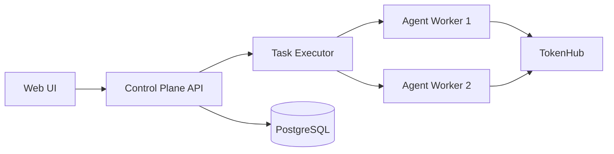

# Loom Architecture Guide

**Last Updated**: February 2026

This document describes the architecture of Loom, the Agent Orchestration System for managing distributed AI workflows.

## System Overview

Loom is a comprehensive agent orchestration platform that:
- Coordinates multiple AI agents with different roles (personas)
- Manages work items (beads) through a distributed workflow engine
- Integrates with external LLM providers for agent execution
- Persists all state to a PostgreSQL database
- Provides a real-time web UI for monitoring and control
- **v1.0**: Multi-user authentication with role-based access control
- **v1.0**: TokenHub integration as sole LLM provider
- **v1.0**: Server-sent events for real-time streaming responses
- **NEW (v1.1)**: Analytics dashboard with real-time usage monitoring
- **NEW (v1.2)**: Motivation system for proactive agent workflows
- **NEW (v1.3)**: Activity feed and team notifications system
- **NEW (v1.5)**: Multi-turn action loop engine with iterative LLM feedback
- **NEW (v1.5)**: Pair-programming mode for interactive human-agent chat
- **NEW (v2.0)**: TokenHub-only architecture
- **NEW (v2.1)**: Temporal removed — Ralph Loop runs as plain Go goroutine ticker

## Core Components

### 1. Agent System

**Purpose**: Manage autonomous AI agents with role-based personas

**Key Files**:
- `internal/loom/worker_manager.go`
- `internal/models/agent.go`

**Concepts**:
- **Agent**: An autonomous actor with a defined role and persona
- **Persona**: Instructions, guidelines, and behavioral rules for an agent
- **Status**: `idle`, `working`, `paused`, `complete`
- **Role**: Org chart position (CEO, CFO, Engineer, etc.)

### 2. Bead System

**Purpose**: Work item management with dependency tracking

**Key Files**:
- `internal/beads/manager.go`
- `pkg/models/bead.go`

**Concepts**:
- **Bead**: A unit of work (like a GitHub issue)
- **Priority**: P0 (critical) through P3 (low)
- **Status**: `open`, `in_progress`, `closed`, `blocked`
- **Dependencies**: Beads can block/be-blocked-by other beads

### 3. Task Executor

**Purpose**: Claim beads and execute agent work loops

**Key Files**:
- `internal/taskexecutor/executor.go`

**Concepts**:
- Direct executor, no external workflow engine
- One goroutine per project, claims open beads and runs the agent loop
- Tracks error history for loop detection and auto-blocking

### 4. Ralph Loop (Maintenance)

**Purpose**: Periodic system health maintenance

**Key Files**:
- `internal/ralph/ralph.go`

**Implementation**: Plain `time.NewTicker` goroutine, runs every 10 seconds.

**Phases**:
1. Reset stuck/zombie agents
2. Auto-block beads stuck in error loops
3. Auto-recover provider-blocked beads

### 5. EventBus

**Purpose**: In-memory pub/sub for internal event distribution

**Key Files**:
- `internal/eventbus/eventbus.go`

**Concepts**:
- Ring buffer with configurable capacity (default: 1000 events)
- Subscriber channels with non-blocking delivery

### 6. Provider System

**Purpose**: Manage LLM provider connections via TokenHub

**Key Files**:
- `internal/provider/`
- `pkg/config/config.go`

**Concepts**:
- **Provider**: An LLM backend (TokenHub proxy)
- **Health**: Checked every 30 seconds
- **Model**: The specific model to use for completions

### 7. Dispatcher

**Purpose**: Match ready beads to available agents

**Key Files**:
- `internal/dispatch/dispatcher.go`

### 8. API Layer

**Purpose**: HTTP REST API for all UI and CLI interactions

**Key Files**:
- `internal/api/`

**Endpoints**: See [API Reference](api.md)

## Data Flow

```
User/CLI
    ↓
HTTP API (internal/api/)
    ↓
Loom Core (internal/loom/)
    ↓
TaskExecutor (internal/taskexecutor/)
    ↓
Agent Worker (internal/agent/)
    ↓
Action Loop → LLM (TokenHub)
    ↓
Git commit / Bead close
```

## Deployment



The Docker Compose stack includes:
- `loom` — Control plane (API + Task Executor + Ralph Loop)
- `loom-postgresql` — Application database
- `pgbouncer` — Connection pooler
- `nats` — Message bus (NATS JetStream)
- `loom-project-{id}` — Per-project agent containers

## State Persistence

All state is persisted to PostgreSQL:
1. **Agents, Beads, Projects, Providers** — Core application tables
2. **Logs** — Structured log entries
3. **Config KV** — Runtime configuration overrides
