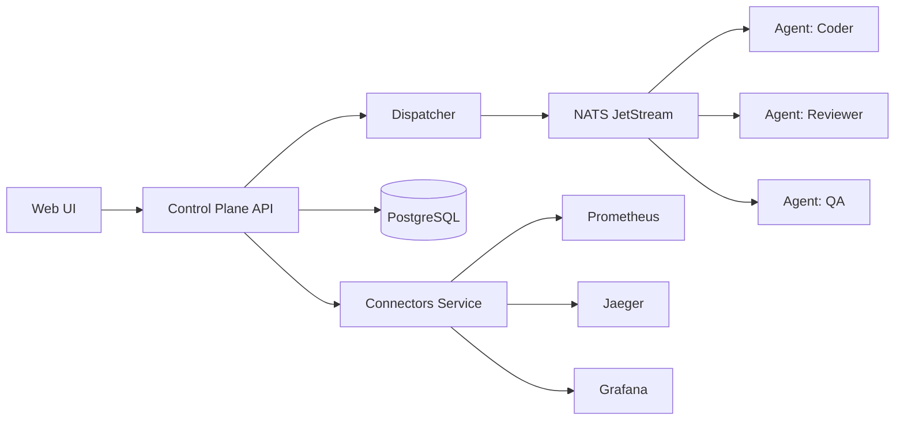

# Loom Documentation

> *"From a single thread of an idea, we weave complete software."*

**Loom** is an autonomous AI agent orchestration platform that coordinates multiple specialized AI agents to build, maintain, and operate software projects.

## What Can Loom Do?

- **Orchestrate AI agents** with specialized roles (PM, Engineer, QA, DevOps, Designer, Code Reviewer)
- **Manage distributed work** through beads (work items) with dependencies and priority
- **Autonomously fix bugs** from detection through investigation, fix, verification, and PR creation
- **Execute reliable workflows** with human-in-the-loop approval gates
- **Bootstrap entire projects** from a Product Requirements Document (PRD)
- **Monitor everything** with Prometheus metrics, Jaeger tracing, and Loki logging

## Quick Navigation

| I want to... | Go to... |
|---|---|
| Get Loom running in 10 minutes | [Quick Start](getting-started/quickstart.md) |
| Learn how to use the web UI | [User Guide](guide/user/index.md) |
| Configure and deploy Loom | [Administrator Guide](guide/admin/index.md) |
| Understand the architecture or contribute | [Developer Guide](guide/developer/index.md) |
| Look up API endpoints or config options | [Reference](guide/reference/entities.md) |

## Architecture at a Glance

## Project Status

Loom is self-maintaining — it uses its own agent pipeline to fix bugs, review code, and ship improvements. All five microservices architecture phases are complete.
